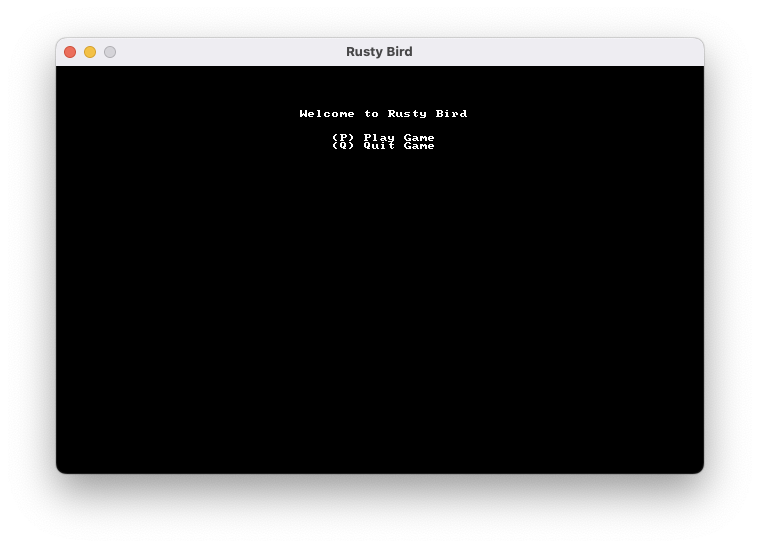
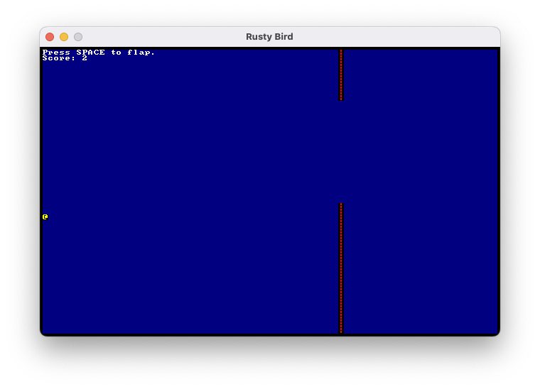
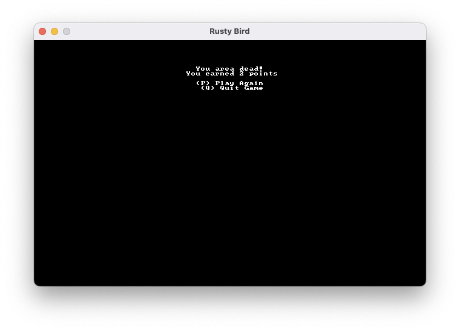

# [Rusty Bird](https://pmuens.github.io/rusty-bird)

A [Flappy Bird](https://en.wikipedia.org/wiki/Flappy_Bird) clone written in Rust following the ["Hands-on Rust" Book](https://pragprog.com/titles/hwrust/hands-on-rust) by Herbert Wolverson. Click [here](https://pmuens.github.io/rusty-bird) to play the game in your browser.

|            Menu            |             Playing              |           End            |
| :------------------------: | :------------------------------: | :----------------------: |
|  |  |  |

## Useful Commands

```sh
nix-shell

cargo new <name>

cargo build
cargo clean
cargo test

cargo run

cargo fmt

cargo clippy

cargo check

cargo install wasm-bindgen-cli
cargo uninstall wasm-bindgen-cli

~/.cargo/bin/wasm-bindgen target/wasm32-unknown-unknown/release/rusty-bird.wasm --out-dir docs/ --no-modules --no-typescript
```

## Useful Resources

- [Rust By Example](https://doc.rust-lang.org/rust-by-example)
- [The Rust Programming Language](https://doc.rust-lang.org/book)
- [rust-lang/rustlings](https://github.com/rust-lang/rustlings)
- [Rust Cookbook](https://rust-lang-nursery.github.io/rust-cookbook)
- [Rust Design Patterns](https://rust-unofficial.github.io/patterns)
- [ctjhoa/rust-learning](https://github.com/ctjhoa/rust-learning)
- [Rust for Professionals](https://overexact.com/rust-for-professionals)
- [The Little Book of Rust Books](https://lborb.github.io/book)
- [Learn Rust With Entirely Too Many Linked Lists](https://rust-unofficial.github.io/too-many-lists)
- [Run Your Rust Games in a Browser](https://hands-on-rust.com/2021/11/06/run-your-rust-games-in-a-browser-hands-on-rust-bonus-content)
